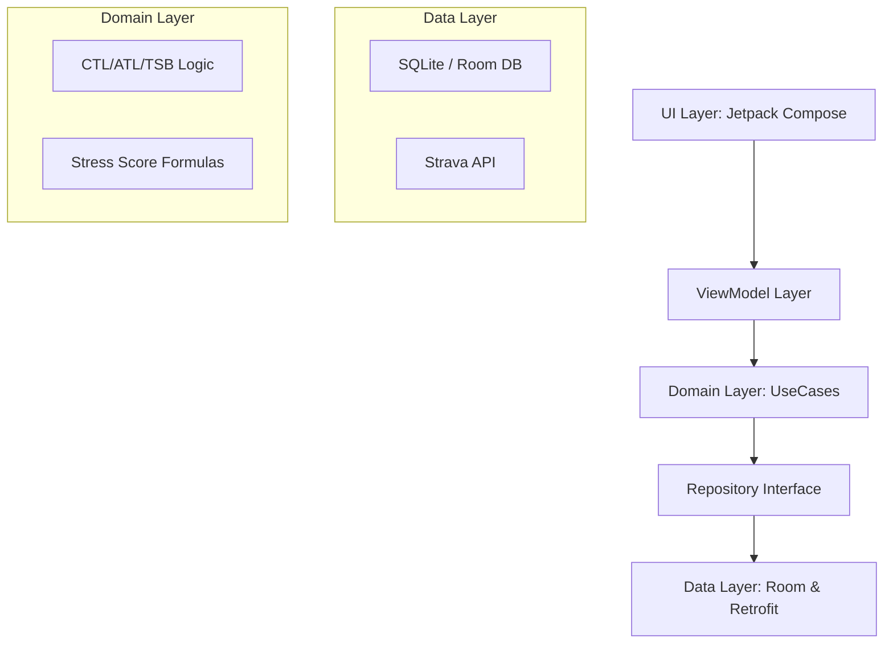
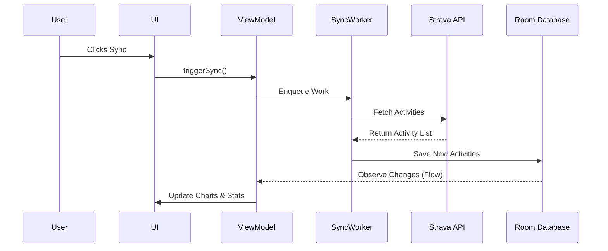

# Elevate V2 - Developer Documentation

This document provides technical details about the Elevate V2 project for developers and contributors.

## Running Tests

To execute all unit tests, including the data-driven intensity tests, run:

```bash
cd V2
./gradlew test
```

Test reports are generated at `V2/app/build/reports/tests/testDebugUnitTest/index.html`.

## Technical Architecture

Elevate V2 follows **Clean Architecture** combined with the **MVVM** pattern.



### Key Components

- **DI (Dependency Injection):** Hilt is used to manage dependencies across the app.
- **Persistence:** Room provides a type-safe abstraction over SQLite for local storage.
- **Background Work:** WorkManager handles long-running sync tasks and heavy computations.
- **Concurrency:** Kotlin Coroutines and Flow for reactive data streams.

## Functional Diagram



## Test Data

Simulated test data for development and testing is located in `V2/app/src/test/resources/test_data/activities.json`.
This dataset represents 45 days of training for a 40-year-old triathlete and is used to verify the consistency of fitness metrics.
